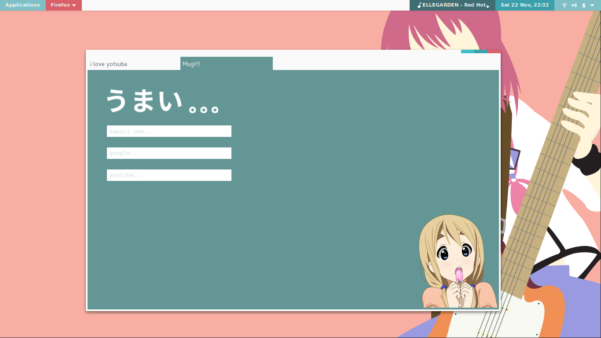

# Kyun
GNOME 3 theme including GNOME Shell, GTK 3, and Metacity (Mutter).

## How to Install to your system
### GNOME Shell, GTK 3, Metacity (Mutter)
* Put the repository in `/usr/share/themes/`.
* Use Gnome Tweak Tool or anything to change the themes.

### Notes
* This theme is not completed yet. Please tell me if there are any problem caused by this theme.
* If you want `mpris` extension has the same color as the preview, please use this fork [mpris-fork](https://github.com/gegenokitaro/gnome-shell-extensions-mediaplayer).
* Every kind of support is very appreciated.

### Future release
* Add `firefox` userstyle.
* Add `plank` theme.

## Bahasa

## Petunjuk pemasangan pada sistem anda
### Berlaku untuk GNOME Shell, GTK 3, dan Mutter
* Letakkan repositori ini ke dalam `/usr/share/themes/`.
* Gunakan Gnome Tweak Tool atau perangkat lainnya untuk mengganti tema yang telah terpasang.

### Catatan
* Tema berikut belum sempurna. Silahkan lapor apabila terdapat kesulitan penggunaan tema ini.
* Jika anda menginginkan agar `mpris` dapat memiliki warna yang sama sebagaimana yang terdapat pada preview, silahkan gunakan [mpris-fork](https://github.com/gegenokitaro/gnome-shell-extensions-mediaplayer).
* Dukungan dalam bentuk apapun sangat diapresiasi.

### Rilis Mendatang
* Penambahan userstyle `firefox`.
* Penambahan tema `plank`
